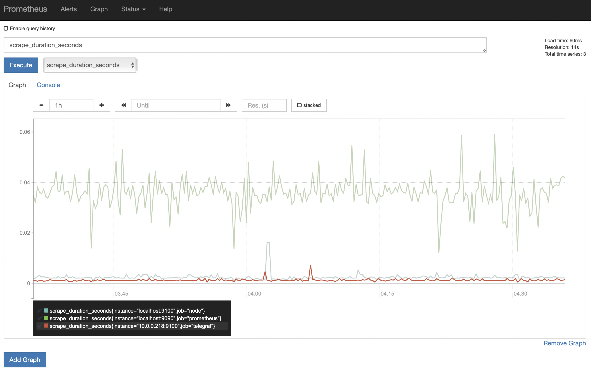

# Telegraf &rarr; Prometheus &rarr; Grafana

## Steps

1. The first step is to install telegraf on my raspberry pi. To do that I ran the following.

       wget -q https://repos.influxdata.com/influxdata-archive_compat.key
       echo '393e8779c89ac8d958f81f942f9ad7fb82a25e133faddaf92e15b16e6ac9ce4c influxdata-archive_compat.key' | sha256sum -c && cat influxdata-archive_compat.key | gpg --dearmor | sudo tee /etc/apt/trusted.gpg.d/influxdata-archive_compat.gpg > /dev/null
       echo 'deb [signed-by=/etc/apt/trusted.gpg.d/influxdata-archive_compat.gpg] https://repos.influxdata.com/debian stable main' | sudo tee /etc/apt/sources.list.d/influxdata.list
       sudo apt-get update && sudo apt-get install telegraf

Just to make sure I have it up and running, I run...

    sudo systemctl status telegraf.service

This command will show the status of the service.

2. Once I have telegraf up and running, I make sure I have snmp installed and listening on my server I want to scrape data from.

    dnf install net-snmp net-snmp-utils

I then wanted to check if it was running by running a...

    sudo systemctl status snmpd

If it wasn't running, I simply started it by running...

    sudo systemctl start snmpd
    sudo systemctl enable snmpd

The enabled command has it start automatically everytime the system boots.

3. Next, we need to go into the configuration file of telegraf and add a few lines to establish an snmp input and a prometheus output. This file is normally located in '/etc/telegraf/telegraf.conf'. Once you find the file, add the following lines of code.

    [[inputs.snmp]]
    agents = ["159.223.145.33"]
    version = 2
    community = "public"

    [[outputs.prometheus_client]]
    listen = ":9273"

This configuration tells Telegraf to collect snmp data from "159.223.145.33" with a community string "public". The data will then output to the Prometheus client on port 9273.

When you have added these lines, go ahead and save the file, then restart telegraf...

    sudo systemctl restart telegraf

4. From here, we need to check if Telegraf is collecting the data and outputting it to Prometheus. We can do that by visiting 'http://10.0.0.218:9273/metrics' (this is just the case for my device, use the ip of the device you're using to run telegraf)

If configured correctly, it should show a list of metrics being collected from the server using snmp, like the following image.

> **_NOTE:_** If there's trouble connecting, you may have to configure the server to allow snmp traffic

5. After we have seen that we are getting snmp data, the next step is to download prometheus. I have done this by running the command...

    wget https://github.com/prometheus/prometheus/releases/download/v2.34.0/prometheus-2.34.0.linux-armv7.tar.gz

This will download it to the current directory. Then we need to extract the files by running...

    tar -xzf prometheus-2.34.0.linux-armv7.tar.gz

This will create a directory called 'prometheus-2.34.0.linux-armv7'. You can then start prometheus by running...

    cd prometheus-2.34.0.linux-armv7
    ./prometheus

6. Prometheus is now running and by default will listen on port 9090. To see the Prometheus UI, you will need to naviagte to 'http://10.0.0.218:9090'. It should look like the following image.

From there you can select what query you want to see by selecting from the drop down menu or typing the query in the input box. Then press execute and a response will be given in the form of a value. This will be in Console mode which should look something like this.

You can also see that query response in the form of a graph by just changing the mode to graph. That should look something like this.

7. Now, we need to take this data and import it into grafana. To do this, we need to install grafana. In my case, I am doing this on my raspberry pi. To do this on Debian, I followed the steps on 'https://grafana.com/docs/grafana/latest/setup-grafana/installation/debian/#2-start-the-server'. 

8. Once installed, we need to start the grafana server. To do this, I run...

    sudo systemctl daemon-reload
    sudo systemctl start grafana-server
    sudo systemctl status grafana-server

If the status says active (running), then we have successfully started the server. To have it start everytime at boot, run...

    sudo systemctl enable grafana-server.service

By default, the port for grafana is :3000. To make sure port 3000 is listening, I run...

    ss -lt

and recieve a response with the line...

    LISTEN    0         4096                     *:3000                   *:*

After this, we can now visit http://10.0.0.218:3000 and our grafana UI login page will come up.

9. From here, we need to login and create the prometheus data source. The first time logging in, the default login will have the 'username: admin' and 'password: admin'. After this, it will ask you to create a new password. 

Now, to add the prometheus data source, we will go to the left side of the page and press the settings button. From that menu, select configuration. This will open a screen where you can add a new data source. Go ahead and click that button and select prometheus.

To add our prometheus output, we will add our Prometheus URL in the HTTP section. In my case, it will be http://10.0.0.218:9090. After inputing this, you can press the Save & Test button at the bottom of the page. If successful, you should see a Data source is working message.

10. Our final step is to pull the data into our own dashboard. We will go to the left menu and select create new dashboard. This will bring us to a page with a New panel and we will select add query. This will create the dashboard and you can choose our prometheus data source from the drop down menu. This will take our prometheus data, and make it available to graph. Select a metric or multiple metrics you want to see on the graph. There are tons of settings and configuring you can do right there on the interface to make the graph show exactly what you want. It should look something like this.

Once finished, you need to save all the changes to the dashboard. Make sure you do this because grafana will not automatically save any of your work.

## Conclusion

Once you have your data in grafana, you can mess around and see so many different metrics. Don't forget you can configure your telegraf configuration file to pull certain data via snmp. This is just a simple example showing the basics.

